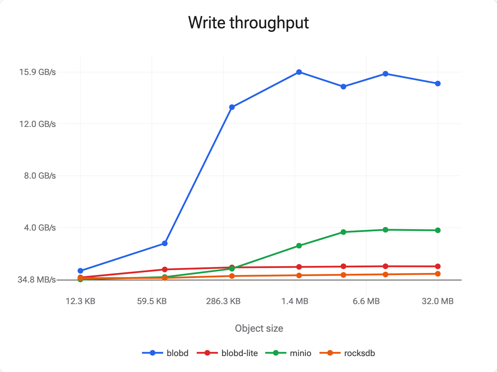
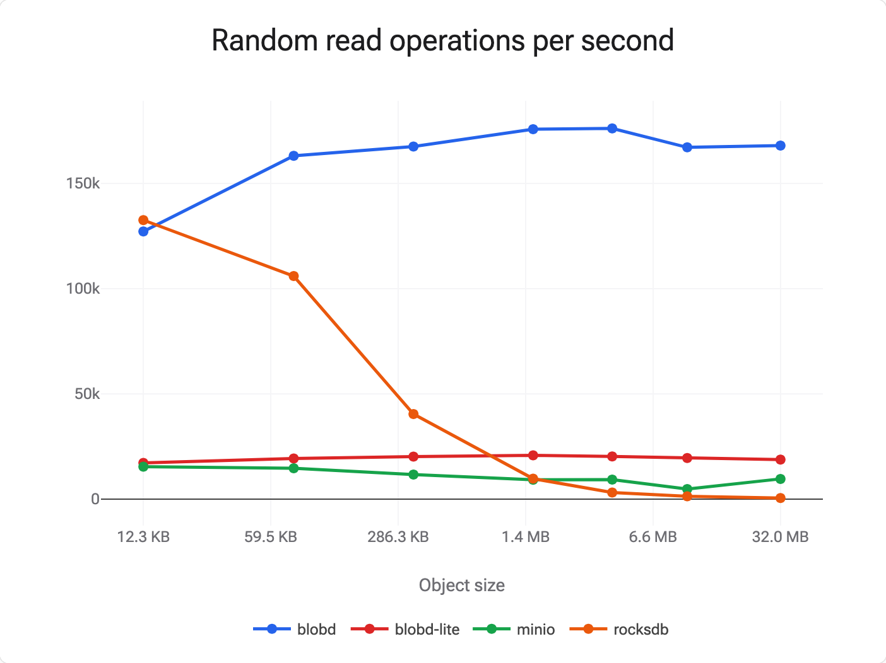

# blobd

Extremely fast object storage, performing at raw device speeds. Achieves constant sub-millisecond latency random partial reads over objects regardless of size.




Read the [blog post](https://blog.wilsonl.in/blobd) for an accessible deep dive.

## Usage

blobd requires Linux 6.11+, a NVMe SSD with support for atomic writes of 512-byte blocks, and direct access to the raw block device. Install the server by using `cargo`:

```bash
cargo install blobd
```

Then set up the configuration file:

```yaml
partitions:
- path: /dev/my-nvme-device
  offset: 0
  len: <length of block device in bytes>
token_secret_base64: abcdef1234567890abcdef1234567890
interface: 127.0.0.1
port: 8080
```

Now you can format the device and start the server:

```bash
blobd --config my-config.yaml --format
blobd --config my-config.yaml
```

The server can now be accessed over HTTP. Clients are available for [Node.js](./blobd-client-js/) and [Rust](./blobd-client-rs/).

## History

This project used to be called *Turbostore* and was written entirely in C; you can still see the code [here](https://github.com/wilsonzlin/blobd/tree/ffb637ae4e4e91602ec04cf2fb2b50aafa116876).
